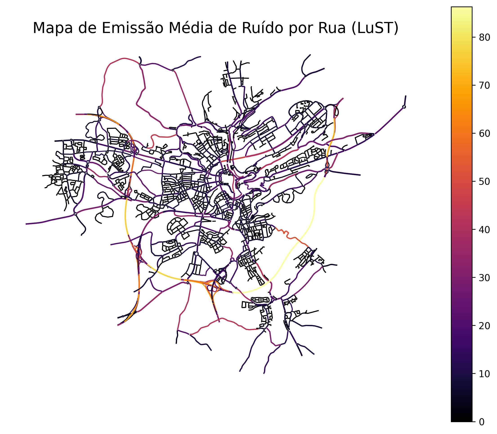
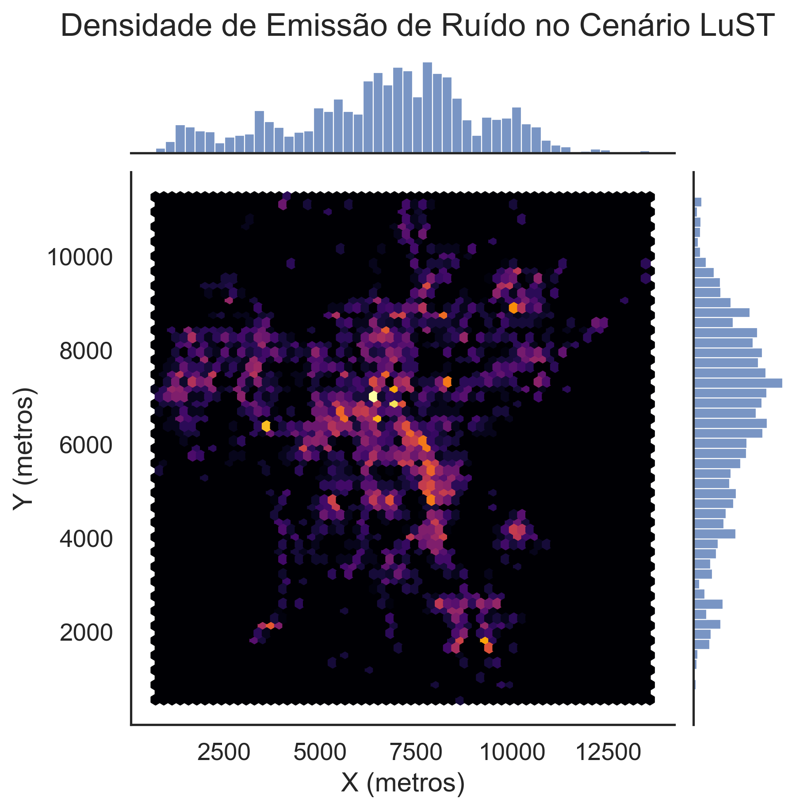
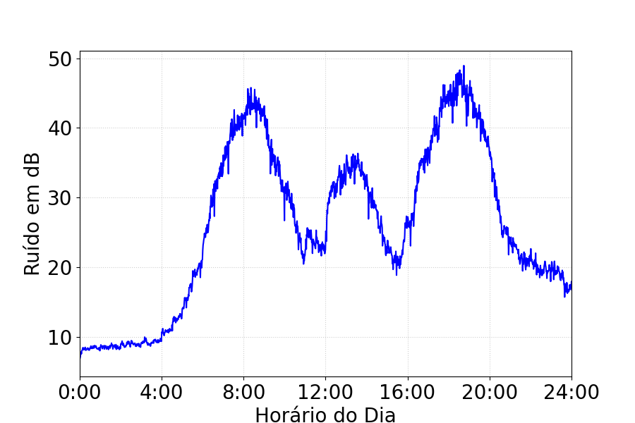
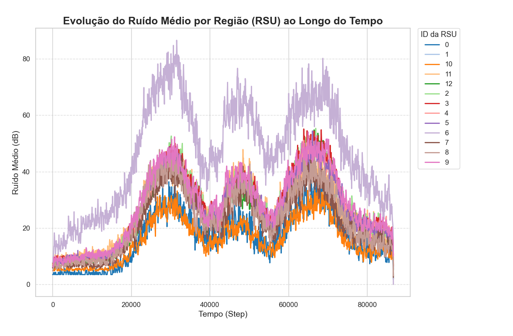

# 📊 Análise e Visualização de Emissão de Ruído no Cenário LuST (SUMO)

Este repositório contém scripts para **extração de dados de simulação**, **agrupamento por RSUs** e **visualização de séries temporais e mapas** relacionados à emissão de ruído em ruas simuladas com o cenário **LuST (Luxembourg SUMO Traffic)**.

## 📂 Estrutura dos Scripts

### 🔧 Extração e Processamento

- **`get_edges.py`**  
  Extrai dados por `edge` (rua) a partir dos arquivos de saída da simulação SUMO. Gera um `.csv` por `edge` contendo colunas como `step`, `road_id`, `average_vehicles` e `noise_emission`.

- **`rsu_group.py`**  
  Agrupa os dados das `edges` com base em regiões cobertas por cada RSU. Pode usar distâncias geográficas ou definição manual das áreas.

---

### 📈 Visualizações Temporais

- **`timeseries_plot.py`**  
  Gera gráficos de série temporal da emissão de ruído por `edge`, mostrando a evolução ao longo do tempo para análise de padrões.

- **`timeseries_per_region.py`**  
  Similar ao anterior, mas agregando por **regiões/RSUs** — útil para comparar zonas diferentes da cidade.

---

### 🗺️ Visualizações Espaciais

- **`map_gen.py`**  
  Gera um **mapa com as ruas coloridas pela emissão média de ruído** usando o `.net.xml` e os dados extraídos por rua.  
  Também gera um **heatmap hexbin** usando `seaborn` com a densidade espacial das emissões.

---

## 🖼️ Exemplos de Saída

### Mapa por emissão média de ruído


### Mapa de calor hexbin


### Série temporal por rua


### Série temporal por região


---

## ⚙️ Requisitos

```bash
pip install pandas geopandas matplotlib seaborn shapely
